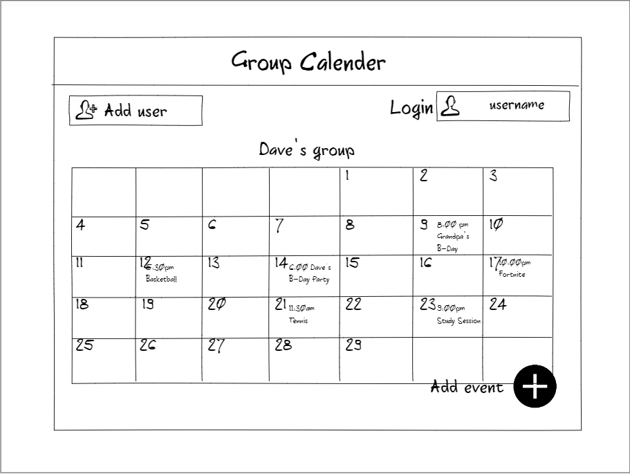
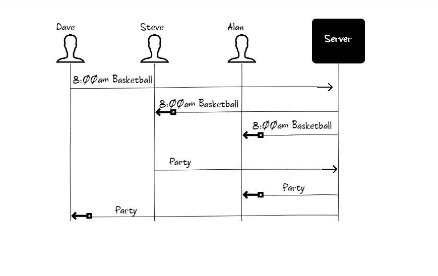

# Group Calender
Tired of your friends never showing up when you all make plans becuase of some last minute birthday party or family dinner they forgot about. With the new app you can create a group calender with your friends or family that shows exactly when you will be busy and when you will have time to play with the boys. All it takes is for each person to download the app and then they can form a group calender that they all can edit and see at the same time. If someone is going to be busy friday night because of their grandpa's birthday party they can put it on the calender so we can plan another day to meet up. 

## Design

Here is a sequence diagram that shows how to people would interact with the backend to vote.

